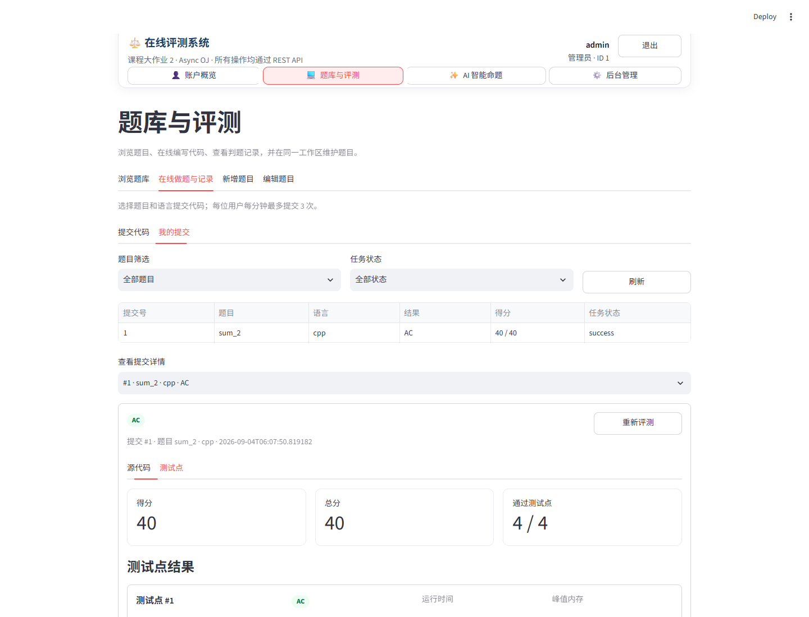

# 在线评测系统实验报告

> 课程大作业 2：在线评测系统  
> 姓名：________________　学号：________________　班级：________________  
> 仓库：https://github.com/OverMoon64/online-judge-system

## 摘要

本项目实现了一个面向课程本地验收的在线评测系统。后端采用 FastAPI、SQLAlchemy Async 与 SQLite，前端采用 Streamlit；系统提供用户与角色管理、题目管理、动态语言配置、异步代码评测、提交检索与重测、公开日志与访问审计，以及基于 OpenAI-compatible Chat Completions 协议的可取消 AI 智能命题流程。所有后端路由均为异步接口，响应统一为 `{code, msg, data}`，并根据课程契约返回真实 HTTP 状态码。

判题器在独立临时目录中以参数数组启动编译器或解释器，不使用 `shell=True`。运行期间同时限制时间、递归统计进程树内存、限制输出大小，并在超时或取消后终止整个进程组。系统支持 AC、WA、TLE、MLE、RE、CE 和 UNK，按每个通过测试点 10 分计分。

AI 模块把命题拆分为需求分析、题面与解法、边界测试点、结构校验与试运行四个阶段，持续报告进度，统计 Token 与费用，并在保存前通过 Pydantic 结构校验和受限判题器试跑参考解法。API Key 只保存在进程内存中，不进入数据库、日志或响应。

## 一、需求与评分点映射

项目以课程当前实验说明、API 契约和评分标准为准，实现基础模块 30 分、AI 智能命题 10 分、代码规范 5 分和实验报告 5 分。评分点与实现的对应关系如下。

| 模块 | 主要实现 | 验证方式 |
| --- | --- | --- |
| 用户与权限 | 签名 Session Cookie、bcrypt、user/admin/banned | 接口测试与人工流程 |
| 题目与语言 | 登录用户可新增/编辑/注册语言，管理员可删除 | 校验与权限测试 |
| 异步评测 | Python/C++14、七种结果、逐点得分 | Linux 真实子进程测试 |
| 提交与统计 | 筛选、分页、限流、重测、通过数去重 | 接口测试 |
| 日志与审计 | 可见性矩阵、成功/拒绝访问记录 | 访问矩阵测试 |
| Streamlit | 用户、题目、提交、日志、AI 页面组 | AppTest/浏览器验收 |
| AI 命题 | 配置、任务、取消、Token/费用、试运行 | 本地假提供商测试 |
| 工程质量 | Ruff、pytest、覆盖率、CI、VS Code | 自动化检查 |

## 二、系统架构

系统采用浏览器、REST API、业务服务、异步数据库与隔离执行器五层结构。Streamlit 不直接访问数据库，而是通过独立 HTTP Session 调用 REST API 并保存 Cookie；权限判断始终在后端完成。

核心目录如下：

```text
app/                 FastAPI 路由、模型、服务、判题器与 AI 工作流
frontend/            Streamlit 页面和 REST 客户端
tests/               接口、判题与 AI 自动化测试
scripts/             演示数据与报告构建脚本
docs/                报告源稿与线下验收清单
.github/workflows/   Ubuntu + Python 3.10 持续集成
.vscode/             WSL 解释器、运行、调试和测试配置
```

## 三、API 契约与权限设计

### 3.1 统一响应与错误优先级

成功和失败响应均使用 `{code, msg, data}`。FastAPI/Pydantic 的默认 422 被统一转换为 400，使接口严格符合课程契约。组合条件按 `401 > 403 > 400 > 429 > 409 > 404 > 500` 检查，避免同一请求因实现顺序不同而返回不稳定结果。

### 3.2 认证、角色与封禁

登录成功后只在签名 Session Cookie 中保存用户标识，密码使用 bcrypt 哈希。初始化和系统重置都会创建 `admin / admintestpassword`。普通用户只能访问本人提交；管理员可管理题目、语言、角色、全部提交与访问审计；被封禁用户即使持有旧会话也会在依赖层被拒绝。

### 3.3 日志可见性与审计

题目支持公开或隐藏测试点日志。管理员始终可查看，普通用户可查看本人提交；题目开启公开后，其他已登录用户也可查看。系统记录资源存在前提下的成功访问和权限拒绝，不记录未登录、参数错误与不存在资源，既满足审计要求，也避免将无效探测写入日志。

## 四、判题器关键实现

提交接口先写入 `pending` 并立即返回，再由后台任务逐测试点评测。每次提交使用独立临时目录；C++14 先在限制时间内编译，Python 直接解释执行。命令模板会检查占位符、可执行程序白名单和参数形式，最终使用参数数组启动，不经 Shell 解析。

运行阶段并行完成：

1. 等待进程结束并执行硬超时；
2. 使用 psutil 递归统计进程树 RSS；
3. 限制标准输出与错误输出大小；
4. 超时、超内存或取消时终止整个 Linux 进程组；
5. 回收子进程并删除临时目录。

输出比对逐行删除行末空格，并忽略最终多余换行，但保留有意义的前导空格。这样既符合常见 OJ 习惯，也不会把缩进不同的内容误判为相同。

## 五、提交、统计与重置

提交列表支持用户、题目、状态筛选和分页。普通用户只能看到本人提交，管理员可以查看所有记录。每个用户每分钟最多提交 3 次，限流检查位于资源存在性检查之前，以符合错误优先级。重新评测复用同一提交 ID，重置状态与逐点结果后重新进入后台队列。

用户详情统计提交总数与通过题数；通过题数按题目去重，避免同一题多次 AC 被重复计算。系统重置会先取消全部判题和 AI 后台任务，再清空业务数据、重建内置语言和初始管理员，并让当前会话退出。

## 六、AI 智能命题

模型设置包括兼容接口 URL、模型名、API Key、输入/输出单价、计价单位和币种。密钥仅保存在当前后端进程内存中，查询接口只返回是否已配置，不返回密钥本身。验收可使用百炼兼容接口与 `qwen3.7-plus`，程序未硬编码厂商。

AI 任务包含四个可观察阶段：需求分析、题面与参考解法、边界测试点、结构校验与试运行。每次模型调用聚合 prompt/completion/total Token；若提供商不返回 usage，界面明确标记无法精确统计。费用依据配置的计价单位计算。

模型输出必须通过严格的 Pydantic 题目结构校验；参考解法还需在同一受限判题器中跑过全部生成测试点。失败时允许一次带错误反馈的修复请求，仍失败则任务进入 failed。取消接口直接取消 asyncio 任务，传播到正在进行的 httpx 请求和本地试运行。

## 七、前端与交互

Streamlit 前端按账户、题目、提交、AI 命题、系统管理分组。用户可注册、登录、退出和查看资料；管理员可修改角色、维护题目和语言。代码提交页支持 Python/C++14，提交详情使用局部刷新显示 pending/running 到最终状态，不阻塞其它页面。

AI 页面可配置模型、启动任务、查看阶段进度与费用、取消任务，并把通过校验的生成结果一键写入题目编辑草稿，要求管理员人工审阅后再保存。



图 1　Streamlit 在线评测系统本地运行界面

## 八、测试设计与边界结果

自动化测试覆盖字段校验、错误优先级、会话、角色与封禁、题目 CRUD、语言命令安全、筛选分页、限流、统计、日志可见性、访问审计、重置与 AI 工作流。Linux 集成测试真实执行 Python 和 C++，覆盖 AC、WA、RE、CE、TLE、MLE、空白字符比对、重新评测和进程清理。

最终在 Ubuntu 22.04、Python 3.10.12、G++ 11.4.0 环境运行 23 个测试，结果为 23 passed；总行覆盖率为 92.70%，超过 CI 设置的 85% 门槛。Ruff 静态检查和格式检查均通过。

AI 测试使用本地假提供商，覆盖成功、非法 JSON、超时/鉴权失败、Token 与费用计算、任务取消，以及生成结果转入编辑器所需的数据结构。CI 在 Ubuntu、Python 3.10 和 G++ 环境执行 Ruff、格式检查与 pytest，并设置 85% 覆盖率门槛。

## 九、安全边界

本项目的进程组、资源限制、命令白名单和临时目录可以满足课程本地验收，但不能等同于内核级强隔离沙箱。若部署到公网，应把判题执行迁移到容器或专用沙箱，并增加只读根文件系统、用户/网络命名空间、seccomp、cgroup、作业队列、审计持久化与反向代理安全配置。

## 十、总结

本实验把异步 Web API、数据库、操作系统进程管理、权限审计和大模型工作流整合为一个可运行、可测试、可演示的系统。实现的重点不是单纯“运行代码”，而是在明确 API 契约下正确处理并发、资源回收、权限优先级、数据一致性和失败路径。项目附带 VS Code Remote WSL 配置、演示种子数据、线下验收清单和持续集成流程，便于重复验证。

## AI 使用说明

本项目开发过程中使用了 AI 辅助进行需求梳理、代码实现、测试设计与报告排版。所有生成内容均通过静态检查、自动化测试或人工审阅验证；AI 模型密钥不写入仓库。验收演示中的 AI 命题结果也必须由管理员人工检查后才能保存为正式题目。
